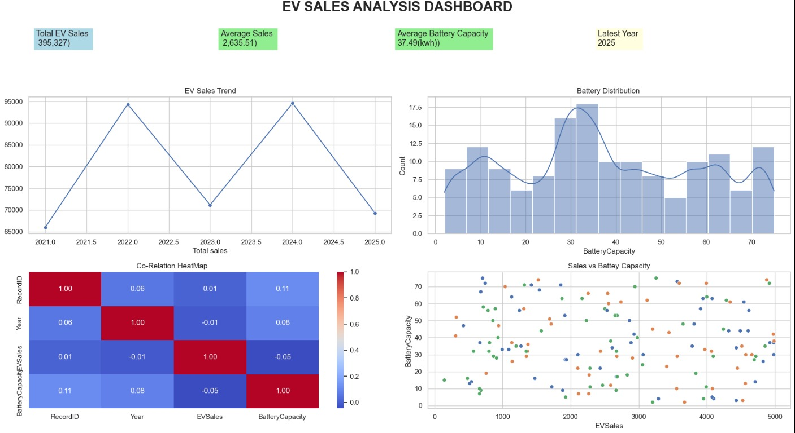

# 🚗 EV Sales Analysis

## 📌 Project Overview

This project analyzes Electric Vehicle (EV) sales data using **Python, Pandas, Matplotlib, and Seaborn**. The objective is to explore EV market trends, manufacturer performance, vehicle type distribution, battery capacity patterns, and state-wise sales performance through data cleaning, exploratory data analysis (EDA), and visualization.

---

## 🎯 Objectives

* Perform data cleaning and quality checks.
* Analyze EV sales trends across years.
* Compare manufacturer-wise sales performance.
* Examine state-wise EV adoption.
* Study battery capacity distributions.
* Identify relationships between battery capacity and EV sales.
* Create visualizations and dashboards for business insights.

---

## 🛠️ Technologies Used

* Python
* Pandas
* NumPy
* Matplotlib
* Seaborn
* Jupyter Notebook

---

## 📂 Dataset Features

| Column          | Description                |
| --------------- | -------------------------- |
| RecordID        | Unique record identifier   |
| Manufacturer    | EV manufacturer name       |
| VehicleType     | Type of electric vehicle   |
| Year            | Sales year                 |
| State           | State where sales occurred |
| EVSales         | Number of EV units sold    |
| BatteryCapacity | Battery capacity in kWh    |

---

# 🔍 Analysis Performed

### Data Understanding

1. Dataset shape
2. Column names
3. Data types
4. Summary statistics
5. Number of unique manufacturers

### Data Cleaning

6. Missing values check
7. Duplicate records check
8. Manufacturer consistency check
9. Invalid year verification
10. Missing vehicle type verification
11. State name consistency check

### Filtering & Query Analysis

12. Andhra Pradesh records
13. EV sales greater than 3000
14. Electric car records
15. Tata vehicles sold in 2024
16. Vehicles with battery capacity > 50 kWh

### Aggregation Analysis

17. Total sales by manufacturer
18. Average sales by state
19. Total sales by vehicle type
20. Total sales by year
21. Average battery capacity by manufacturer

### Ranking Analysis

22. Top 10 highest sales records
23. Bottom 10 sales records
24. Manufacturer sales ranking
25. State sales ranking
26. Vehicle type sales ranking

### Statistical Analysis

27. Maximum EV sales
28. Minimum EV sales
29. Average EV sales
30. Mode of EV sales
31. Variance of EV sales
32. Standard deviation of EV sales

### Business Insights

33. State with highest total EV sales
34. Manufacturer with highest total EV sales
35. Vehicle type contributing the most sales
36. State-Manufacturer sales combinations
37. Year with highest EV sales

### Data Visualization

38. EV sales trend over years
39. Manufacturer contribution to EV sales
40. State-wise EV sales comparison
41. Vehicle type distribution
42. Battery capacity distribution
43. Battery capacity vs EV sales relationship
44. Manufacturer-wise sales comparison (Seaborn)
45. Battery capacity variation by vehicle type
46. Battery capacity distribution using Histplot
47. Correlation Heatmap

---

# 📊 Visualizations Included

### 📈 Line Chart

* EV Sales Trend Over Years

### 📊 Bar Chart

* Manufacturer-wise EV Sales

### 📉 Horizontal Bar Chart

* State-wise EV Sales

### 🥧 Pie Chart

* Vehicle Type Distribution

### 📋 Histogram

* Battery Capacity Distribution

### 🔵 Scatter Plot

* Battery Capacity vs EV Sales

### 📦 Box Plot

* Battery Capacity by Vehicle Type

### 🔥 Heatmap

* Correlation Analysis

### 📊 Project Dashboard

---

# 💡 Key Insights

### EV Sales Trends

* EV sales vary significantly across years.
* Certain years experienced stronger market growth than others.
* Yearly trend analysis helps understand EV adoption patterns.

### Manufacturer Performance

* Sales performance differs among manufacturers.
* A few manufacturers contribute a major portion of total EV sales.
* Manufacturer rankings highlight market leaders.

### State-wise Performance

* EV adoption varies across states.
* Some states contribute significantly more sales than others.
* Regional analysis helps identify high-demand markets.

### Vehicle Type Analysis

* Different vehicle categories contribute differently to total sales.
* Vehicle type distribution reveals consumer preferences.

### Battery Capacity Analysis

* Most vehicles are concentrated around medium battery capacities.
* Extreme battery capacities are less common.
* Battery capacity is an important factor influencing EV characteristics.

### Correlation Analysis

* Numerical variables show varying degrees of correlation.
* Heatmap visualization helps identify relationships between sales, battery capacity, and year.

---

# 📈 Dashboard Components

The dashboard includes:

✅ Total EV Sales KPI

✅ Average EV Sales KPI

✅ Average Battery Capacity KPI

✅ Latest Available Year KPI

✅ EV Sales Trend Chart

✅ Battery Capacity Distribution

✅ Battery Capacity vs EV Sales Analysis

✅ Correlation Heatmap

---

# 🎓 Learning Outcomes

Through this project, I learned:

* Data Cleaning Techniques
* Exploratory Data Analysis (EDA)
* GroupBy Operations
* Aggregation Functions
* Statistical Analysis
* Data Visualization using Matplotlib
* Advanced Visualization using Seaborn
* Dashboard Design Principles
* Business Insight Generation

---

# 🚀 Future Improvements

* Build an interactive dashboard using Power BI.
*  Implement regression or time-series forecasting (like ARIMA or Prophet) to predict future EV sales trends based on historical data.
* Add forecasting models for EV sales prediction.
* Create geographical sales visualizations.
* Develop an interactive web dashboard using Streamlit.

---

## 👨‍💻 Author

**Yuva Satya Durga Karthik Kotipalli**
3rd Year B.Tech Student
Aspiring Data Analyst | Python | SQL | Power BI Learner

⭐ If you found this project useful, consider giving it a star on GitHub!
